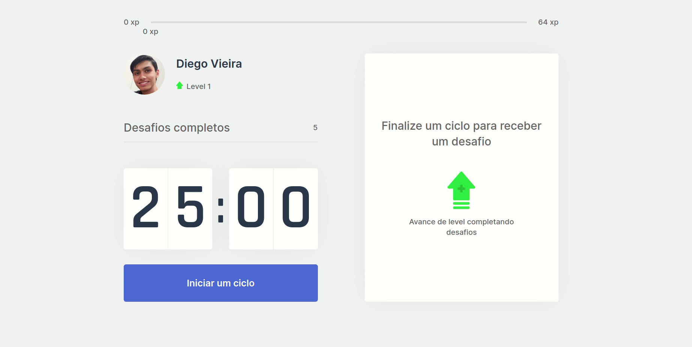
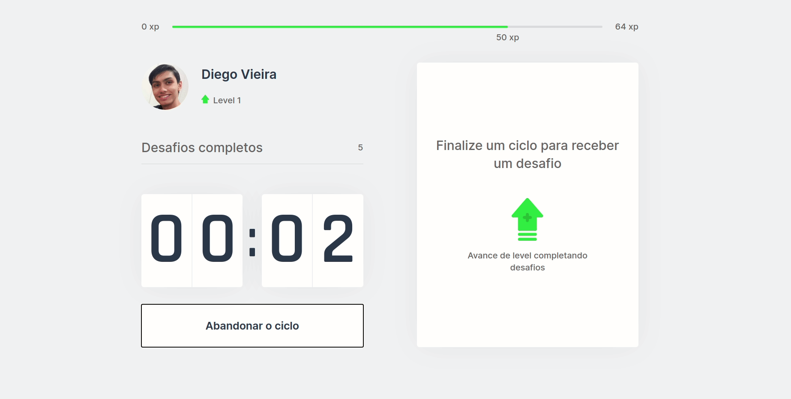
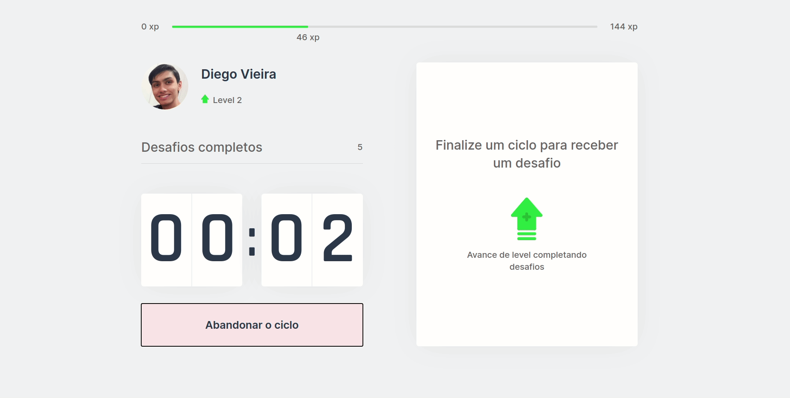
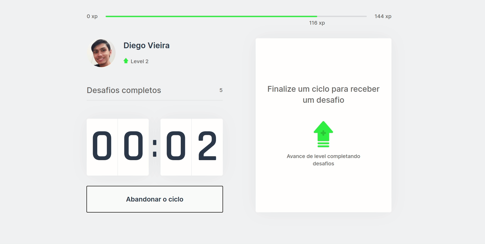

# 🎾 Move IT

This project is from Next Level Week by Rocketseat. It consists of a pomodoro style timer that suggests exercises for the dev to do on the breaks, with a game like leveling system to bring extra motivation to users.

This was made as a way to study React's Context API and Next.js.

## ⚡ Demo
You can access it [here](https://moveit-one-green.vercel.app)! And even install it (it's a **PWA**)!

When you first use the app, you can start a countdown and code/work until it ends.

  

When the countdown ends, you'll receive a web notification and a random exercise challenge to be followed. If you manage to complete the challenge, you are awarded with exp so that maybe you can level up!

  

Or, if you fail to accomplish the challenge, you don't get exp. Either way, the countdown resets, and you can start it again.

  

As you level up, you'll need more and more exp to reach the next level. Just like a real RPG game!

  

## 💻 Project's Techs

- [React](https://reactjs.org/)
- ⭐ React Context API
- [Next.js](https://nextjs.org/) and [Create Next App](https://create-next-app.js.org/)

## 🚀 Run

- Clone repository `git clone <REPO_URL>`
- Install dependencies `yarn install`
- Start server `yarn dev`
- Open [http://localhost:3000](http://localhost:3000)